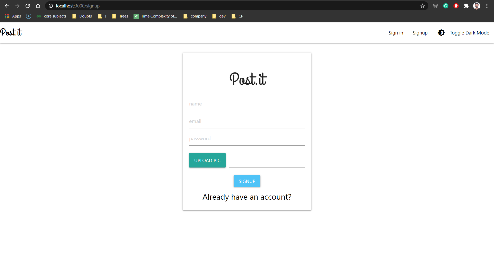
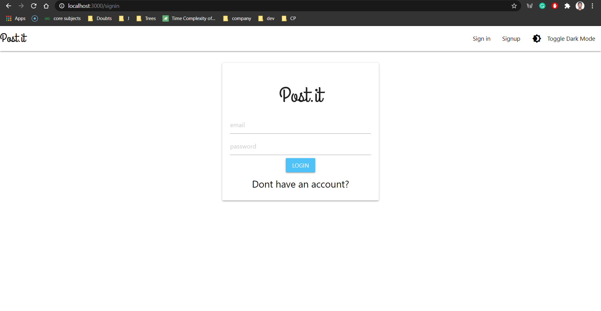
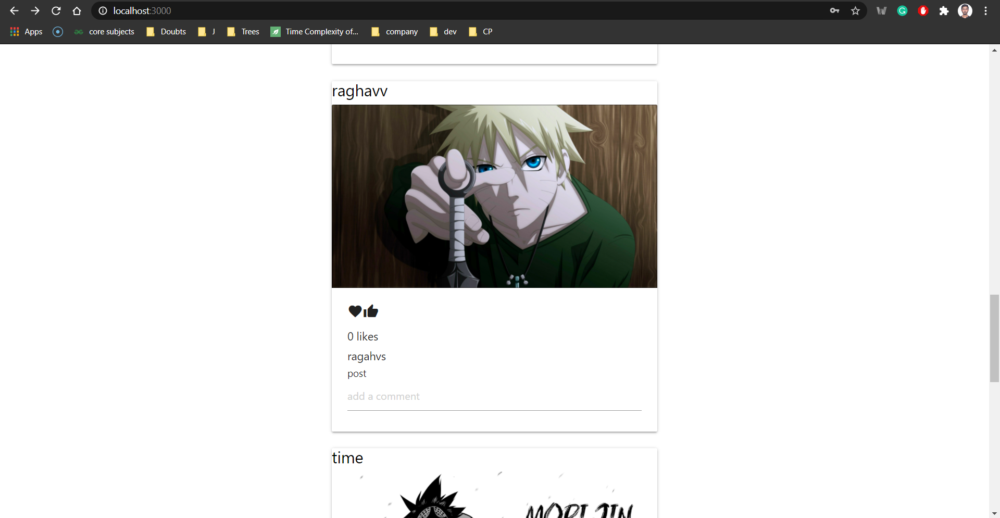
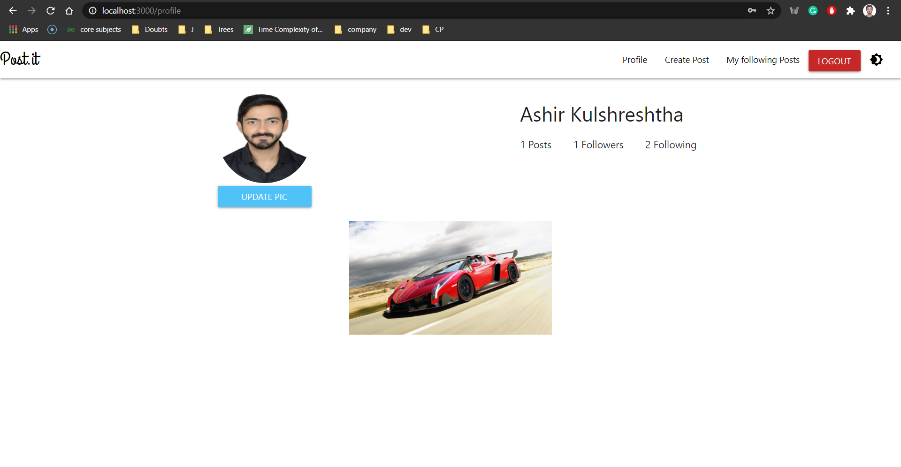
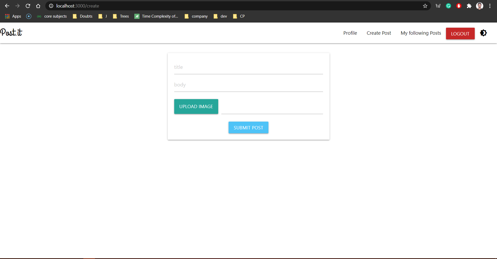
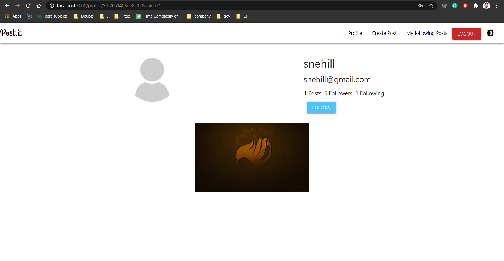
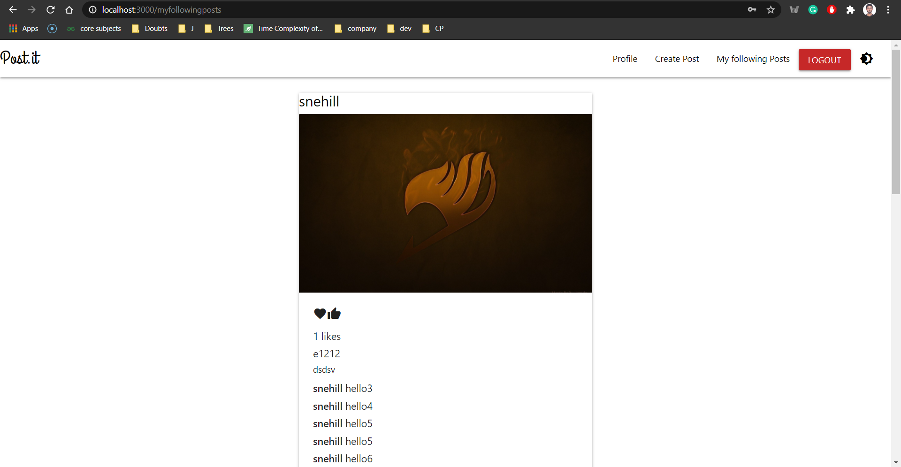

# Post.it
*A social media MERN Project to connect to people.*

# Features :
  - Cloud based DB
  - Dark Mode
  - User Accounts
  - Auth System
  - Profile Page
  - Create new Post
  - Follower's Profile
  - Follow/Unfollow User
  - Posts Management
  - Like/Dislike Post
  - Post Comments
  - Home Page
  - My Following's Page
  - Profile Pic Update 
  - Success/Error Toast Messages
 
 # Dependencies : 
 **Note : No need to install dependencies individually just follow command section to run the application.**
 
 
 ### Backend :
 
 1) Express : `npm install express`
 
 2) MongoDB Atlas : 
    Used as Database for storing your information `npm install mongoose`.
 
 3) Nodemon(Optional) : `npm install nodemon`
 
 4) JWT Token : 
    For User Authentication and Session Management.
    `npm install jsonwebtoken`.
    
 5) BycryptJs 
    For Encrypting Passwords and Sensitive Data `npm install bycryptjs`.
    
    
 ### Frontend :
 
 1) React : 
        `npx create-react-app <name>` 
        `npm install react-router-dom`
        
 2) Materialize CSS :
    `npm install materialize-css@next`

# Command
Create "keys.js" file in Backend folder and paste - 
`module.exports = {
    MONGOURI : "<Your Mongo URI>",
    JWT_SECRET: "Any alphanumeric token"
}`
 
 Run `npm install` in Backend folder to install all backend dependencies.
 
 Run `npm install` in Client folder to install all frontend dependencies.
 
 For backend ->
   Start sever by running `node app.js` in backend folder.
   
 For frontend -> Run `npm start` in client folder. 
 
 
# Screenshots :

Sign up : 

Login : 

Homepage : 

Profile :

Create Post Page :

Follower/Following's Profile :

My Following's Post :

